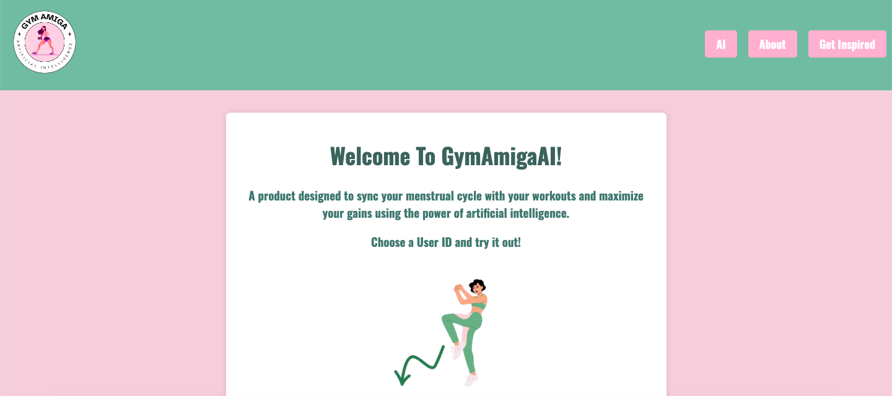

# Welcome to GymAmigaAI
### GymAmigaAI is a health and wellness web application designed to help women optimize their workout routines by syncing them with their menstrual cycles. The application uses artificial intelligence to provide personalized exercise recommendations tailored to each user's unique cycle data. 

  

### Currently, this is a demo version utilizing synthetic data, with plans to expand and integrate real user data in the future.

## "AI" Page

## "About" Page

## "Get Inspired" Page

#### Features
- AI-Powered Exercise Recommendations: Customized workout suggestions based on menstrual cycle phases to optimize performance and recovery.
- Demo with Synthetic Data: Demonstrates capabilities using sample user data to ensure PRIVACY and allow users to explore the app's features.
- Interactive User Interface: Simple and intuitive UI for entering user data and displaying workout recommendations.
- Future Scalability: Designed to scale up with real user data for more accurate and personalized insights.

#### Technologies
- Python: Core programming language for backend development.
- Flask: Lightweight WSGI web application framework used for building the server-side of the app.
- TensorFlow: Machine learning library used to develop the AI model for workout recommendations.
- Pandas: Data manipulation and analysis library for handling and processing user data.
- Scikit-learn: Machine learning library used for data preprocessing and model evaluation.
- NumPy: A fundamental package for scientific computing with Python, used to perform numerical operations and optimize the performance of AI models by handling large arrays and matrices efficiently.
- HTML/CSS: Frontend structure and styling, including responsive design for various devices.

#### Set-Up Instructions
- Clone the repository
- Set up a virtual environment  
- Install dependencies: pip install -r requirements.txt
- Run the application:
1. Make the Sample Data: python generate_fake_data.py
2. Train the AI: python train_test.py
3. Run The Flask App: python app.py 

#### Usage
- Navigate to the "AI" tab to start receiving personalized workout recommendations based on your menstrual cycle.
- Use the "About" tab to learn more about how the application works.
- Visit the "Get Inspired" tab to see the future of this app.
